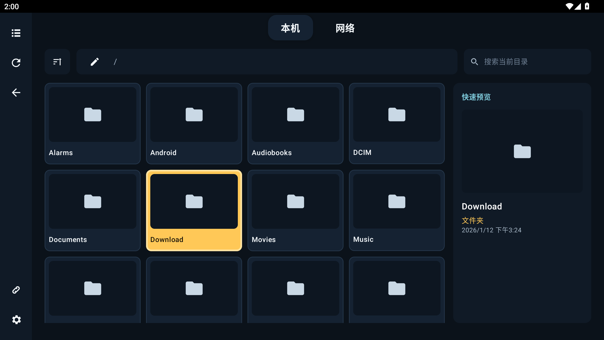

# Good TVplorer

  

  为 Android TV、电视盒子和投影设备设计的遥控器文件浏览器

Good TVplorer 让你在电视上用同一套操作浏览本机文件和 SMB / NAS 媒体库，无需鼠标，也无需在多个应用之间切换。

## 你可以用它做什么

- **用遥控器浏览文件**：支持方向键移动焦点、OK 打开和 Back 返回，也兼容触屏操作。
- **连接家中的 NAS**：保存并管理多个 SMB 共享，在本机存储与网络来源之间快速切换。
- **快速找到文件**：递归搜索当前目录及子目录，并按名称、大小或修改时间排序。
- **直接预览常用媒体**：查看图片和文本，播放音频与视频。
- **获得更完整的播放体验**：支持 LRC 歌词、SRT / 内嵌字幕、播放进度与倍速控制。
- **回到上次浏览位置**：重新打开应用或切换来源后，可恢复最近目录和目录焦点。
- **选择喜欢的浏览方式**：在列表与网格视图之间切换，并调整全局字体大小。

## 使用前准备

- Android TV、电视盒子或投影设备
- Android 6.0（API 23）及以上
- `armeabi-v7a` 或 `arm64-v8a` 设备
- 遥控器或 D-pad
- 如需访问 NAS：准备好 SMB 地址、共享名称和登录信息

## 安装与上手

项目当前尚未发布预编译 APK。请先按[构建说明](docs/architecture.md#构建与验证)生成 Debug APK，并安装到设备。

1. 首次启动时，根据系统提示授予媒体文件访问权限。
2. 使用顶部 Dock 在“本机”和“网络”之间切换。
3. 首次使用网络来源时，打开连接管理并填写 Host、Port、Share、用户名、密码与 Domain。
4. 聚焦文件后按 OK 打开；按 Back 返回上一级或退出预览。
5. 在本机 / 网络根级或文件内容区之外，连续按两次 Back 退出应用。

Android 14 及以上可能要求你选择允许访问的照片和视频范围。应用只能显示系统已授权的内容。

## 支持的预览

| 类型 | 可用功能 |
| --- | --- |
| 图片 | 全屏查看、同目录图片切换、缩略图胶卷 |
| 视频 | 本机 / SMB 流式播放、字幕、倍速、进度与画面模式 |
| 音频 | 本机 / SMB 流式播放、内嵌封面、同名 LRC 歌词 |
| 文本 | UTF-8 文本、行号、自动换行和遥控器翻页 |

## 当前限制

- 当前以浏览和预览为主，暂不支持复制、移动或删除文件。
- 本地文件的可见范围受 Android 系统权限限制。
- 视频缩略图依赖设备的系统媒体解析能力，部分格式可能无法生成或加载较慢。
- 歌词和外挂字幕需与媒体文件同名并放在同一目录。
- 媒体能否播放还取决于设备支持的音视频编码。

## 参与开发

构建、测试、项目结构、数据流与实现约束统一记录在
[`docs/architecture.md`](docs/architecture.md)。

- [`DESIGN.md`](DESIGN.md)：电视端 UI、焦点与交互规范
- [`PRODUCT.md`](PRODUCT.md)：产品定位与设计原则

欢迎通过 [Issue](https://github.com/gbandszxc/good-tvplorer/issues) 反馈问题或建议，也欢迎提交 Pull Request。

## License

MIT License © 2026 Good TVplorer Contributors
